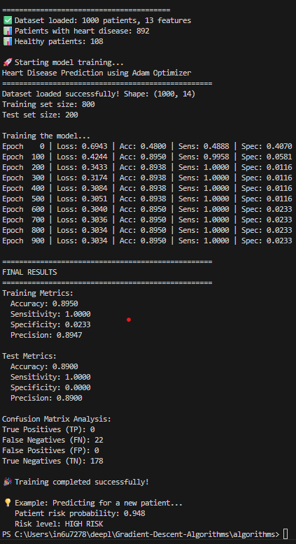

# Heart Disease Prediction with Gradient Descent (Adam Optimizer)

## Overview

This project implements a machine learning model for heart disease prediction using a modified **Adam optimization algorithm**. It leverages gradient descent to minimize the loss function and optimizes model parameters for accurate disease risk classification based on clinical data.

The dataset is a synthetic yet realistic simulation of patient medical features relevant to cardiovascular risk.

---

## Features

- Realistic heart disease dataset with 1000 patient records
- Modified Adam optimizer tailored for healthcare data
- Computation of medical evaluation metrics: accuracy, sensitivity (recall), specificity, precision
- Visualization of training loss, accuracy, sensitivity, and specificity over epochs
- Confusion matrix with true positive, false positive analysis
- Example patient prediction demonstrating risk score estimation

---

## Output

- Training progress log with loss and medical metrics
- Training history plots (loss, accuracy, sensitivity, specificity)
- Confusion matrix plot on the test set
- Example patient risk prediction

---

## Notes

- The dataset is synthetic but models real medical risk factors.
- Metrics such as sensitivity and specificity are critical in healthcare to understand true positive and negative rates.
- This implementation serves as a foundational prototype for applying gradient descent optimization to healthcare classification tasks.

---

## License

This project is licensed under the MIT License.

